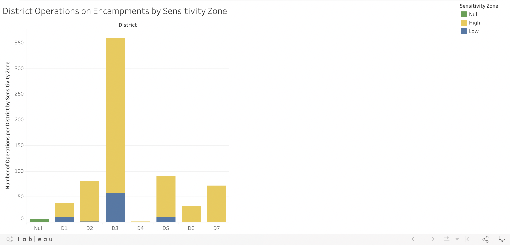

# Encampment-mgmt-in-Oakland

In October of 2020, the Oakland City Council adopted an Encampment Management Policy for Unhoused Residents. The policy aims to: 
Designate high-sensitivity areas, where unmanaged encampments are presumed to cause unreasonably high levels of health and safety impacts due to the nature of the location;
Designate low-sensitivity areas, where enforcement will not be prioritized.
See https://www.oaklandca.gov/topics/encampment-management-team. 

I created this stacked bar in chart using data taken from the City of Oakland Data Hub to show the share of high sensitivity and low sensitive areas per defined district. Data was parsed using Python Pandas from strings in a CSV file, before being converted to an excel file for Tableau visualization. 

Data is from https://www.oaklandca.gov/topics/encampment-management-team. 

Tableau visualization can be found here https://public.tableau.com/views/EncampmentManagement/DistrictOperationsonEncampmentsbySensitivityZone?:language=en-US&:display_count=n&:origin=viz_share_link. 
